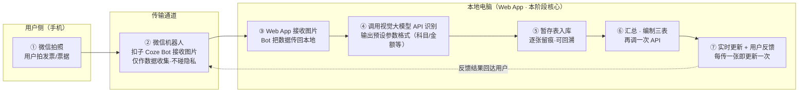
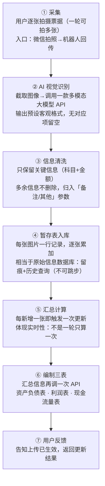
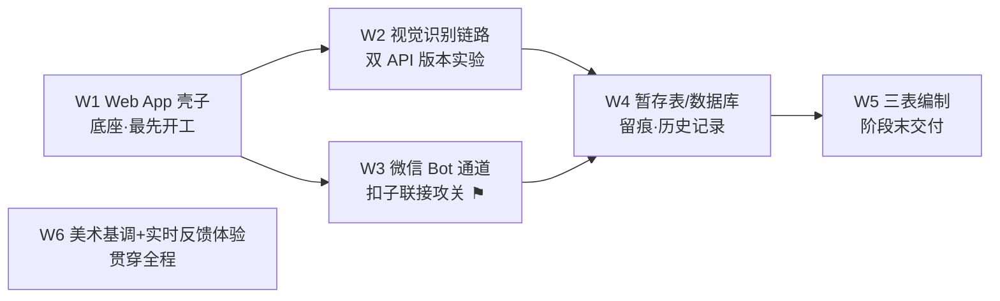
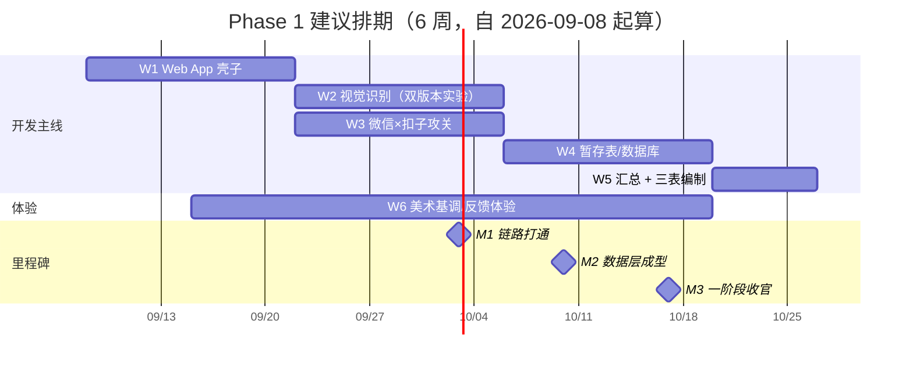

# AI 中小微企业智能财务系统 · 一阶段（Phase 1）开发计划

> 依据 **2026 年 9 月 7 日项目会议录音**（约 24 分钟）整理 · 项目阶段：Phase 0 企划已完成 → **Phase 1 启动** · 整理日期：2026-09-07

**目录**

- [00 会议精神 · 核心共识](#00-会议精神--核心共识)
- [01 一阶段目标与范围](#01-一阶段目标与范围)
- [02 端到端业务链路图](#02-端到端业务链路图)
- [03 数据处理流程详解](#03-数据处理流程详解)
- [04 技术架构分层](#04-技术架构分层)
- [05 关键决策与技术选型](#05-关键决策与技术选型)
- [06 任务分解（WBS）](#06-任务分解wbs)
- [07 里程碑与建议排期](#07-里程碑与建议排期)
- [08 行动项与风险清单](#08-行动项与风险清单)

---

## 00 会议精神 · 核心共识

本次会议把第一阶段"做什么、怎么做、先做什么"谈透了，形成六条共识：

| # | 共识 | 要点 |
|---|------|------|
| 1 | **API 外接，不自研模型** | 系统能力建立在外接大模型 API 之上：用 Web App 调用多模态大模型完成票据图像识别，技术门槛不高，团队有同类项目经验 |
| 2 | **一款 API 一站式识别** | 票据识别尽量只调用一款 API：输入截取图像，输出预设的客观格式（几十种参数，无则留空）；科目识别不是问题，现有 AI 能力早已足够 |
| 3 | **暂存表不可跳步** | 识别结果先入"临时表格"（暂存数据库）留痕，再汇总编制三表——"不要跳步，这玩意挺重要"，每张票据的关键信息（科目、金额）都要可回溯 |
| 4 | **实时反馈** | 每拍一张、每上传一次，就更新一次汇总与三表，并向用户反馈——"不然用户怎么知道他上传了有没有用" |
| 5 | **本地优先，暂缓上云** | 整条链路先在本地跑通：Web App 跑在个人电脑上，数据经微信机器人回传本地处理，"还没到要租用服务器的时候" |
| 6 | **先通链路，呈现靠后** | 优先打通"拍照→识别→暂存→三表→反馈"全链路；Dashboard 与数据呈现属于后续阶段的事 |

> **工作方法论**："我们只做我们想做的事，重点在敢想；至于怎么实现、实现得多好，那是 AI 的事——现阶段想法还比较幼稚，届时把想法和缺的技术细节丢给 AI 补充，再靠个人实力把它 carry 出来。"

---

## 01 一阶段目标与范围

**一句话：做出可用的"壳子 + 全链路"——把票据照片变成三大报表，并在第一阶段末尾完成数据库构建与报表编制。**

```
Phase 0 企划立项（已完成）  →  Phase 1 全链路打通（本计划）  →  Phase 2 呈现与深化
                              拍照上传→AI识别→暂存库→三表→反馈    Dashboard、可视化、云端化
```

| ✅ 做（In Scope） | ❌ 不做（Out of Scope） |
|---|---|
| ① Web App 壳子（调用外接 API） | ① Web UI 内直接拍摄（Web 端只接收图片） |
| ② AI 视觉识别票据，输出预设参数格式 | ② Dashboard / 数据呈现层（Phase 2） |
| ③ 微信机器人（扣子 Bot）图片上传通道 | ③ 云端服务器部署（本地跑通前不考虑） |
| ④ 暂存表 / 数据库构建（留痕 + 历史记录） | ④ QQ 机器人通道（封号风险，已否决） |
| ⑤ 数据汇总与三表编制 | ⑤ 自研模型 / 训练（全部走外接 API） |
| ⑥ 每次上传后的实时更新与用户反馈 | |
| ⑦ 整体美术基调确定（出几个版本挑选） | |

---

## 02 端到端业务链路图

会上反复复述并对齐的主链路："用户在微信里拍照发给机器人 → 数据回传本地电脑 → 调 API 识别 → 入暂存表 → 汇总编三表 → 每传一次更新一次并反馈用户。"



**关键约束：全段在"本地电脑 + 外接 API"上闭环，暂不上云。**

---

## 03 数据处理流程详解

"以时间为序：发票拿来 → 拍照 → 文字识别 → 去掉多余信息只留关键信息 → 入临时表 → 编制三表。" 暂存表是中间过程，但必须显式做出来。



---

## 04 技术架构分层

四层结构，全部围绕"外接 API + 本地闭环"搭建：

| 层 | 组成 |
|---|---|
| **接入层** | 微信拍照 → 扣子 Bot（数据收集，仅接收）→ 图片回传本地 ｜ Web UI 只接收图片、不做拍摄 |
| **应用层** | 本地 Web App（壳子）：接收图片 · 编排 API 调用 · 汇总计算 · 实时反馈 |
| **数据层** | 暂存表（每张票据关键信息留痕 / 历史记录）→ 汇总 → 三表编制 |
| **能力层（外接）** | 多模态大模型 API：视觉识别 + 报表编制（双版本实验：千问端口 / 备选端口） |

---

## 05 关键决策与技术选型

### 5.1 大模型 API：双版本并行实验

| 候选 | 视觉识别 | 科目/文本理解 | 会上评价 | 结论 |
|---|---|---|---|---|
| **千问（Qwen）** | ✅ 支持 | 可用 | "尽量一站式只用一个 API""直接拿千问" | **首选**，视觉链路主力 |
| **DeepSeek** | ❌ 目前视觉不行 | ✅ 历史表现最好 | "科目识别上 DeepSeek 表现最好，但视觉还不行" | 备选端口，文本环节可实验 |

> **实验安排**：实验品同时开发两个版本（一个千问端口、一个备选端口），"回头都试一下"，用实验结果定最终 API。

### 5.2 上传通道：微信 Bot 方案胜出

| 方案 | 结论 | 理由（会上要点） |
|---|---|---|
| Web UI 直接拍摄 | ❌ 否决 | "正常工作人员不会懒得打开网站去拍照"——Web 端只接收图片，拍摄交给手机 |
| 读取钉钉/微信聊天记录 | ❌ 否决 | "提取聊天记录都失败了""高度涉及用户隐私，相当于对用户账号操作" |
| QQ 机器人 | ❌ 否决 | 技术可行（成员做过 QQ 互通聊天机器人），但"不安全、很容易被封"，且需另登一个 QQ 号 |
| **微信 + 扣子（Coze）Bot** | ✅ **采用** | 用户微信拍照 → 发给 Bot → Bot 传回本地 App。Bot 只做信息接收方。微信侧联接方式"还没研究过"，**列为待办攻关** |

### 5.3 部署策略与美术基调

| 事项 | 决策 | 说明 |
|---|---|---|
| 部署 | **本地优先** | 第一阶段整条链路在本地电脑跑通，"还没到要租用服务器的时候"；上云延后 |
| 美术基调 | **参考 Apple 系软件** | "必须得好看"；重点在**反馈手感**（贴合手指滑动的物理动效）；由负责人**跑几个版本给大家挑** |
| 优先级 | **链路 > 呈现** | "先把这条链路打通"；Dashboard / 数据呈现属 Phase 2 |

---

## 06 任务分解（WBS）

按会议讨论归并为 6 个工作包。依赖关系：W1 是底座，W2/W3 可并行，W4→W5 串行，W6 贯穿全程。



| 工作包 | 关键任务 | 产出物 | 依赖 |
|---|---|---|---|
| **W1** Web App 壳子 | 搭建本地 Web 应用骨架；图片接收与 API 调用编排 | 可运行的本地 Web App | —（有过往项目经验） |
| **W2** 视觉识别链路 | 截图输入→API→预设参数格式输出；科目识别；多余信息归入"备注/其他" | 识别接口模块 × 2 个 API 版本 | W1 |
| **W3** 微信 Bot 通道 | 研究微信与扣子（Coze）的联接；Bot 接收图片回传本地 | 可用的微信上传通道 | W1；⚑ 技术攻关点 |
| **W4** 暂存表/数据库 | 暂存表结构（科目、金额、备注、时间序）；逐张入库留痕；历史查询 | 暂存数据库 + 记录机制 | W2、W3 |
| **W5** 汇总与三表编制 | 暂存表汇总；每传一张实时更新；再调一次 API 编制三大报表 | 资产负债表/利润表/现金流量表输出 | W4 |
| **W6** 美术与反馈体验 | 美术基调（参考 Apple 扁平化）；多版本 UI 挑选；反馈与滑动手感动效 | 2–3 个 UI 版本 + 定稿基调 | 贯穿全程 |

---

## 07 里程碑与建议排期

会议未明确具体日期，以下为按依赖关系建议的相对排期，**实际节奏以下次例会确认为准**。



| 里程碑 | 标志 | 建议时点 |
|---|---|---|
| **M1 链路打通** | 手机拍照 → Bot → 本地 App → 识别 → 入库，全链路本地跑通 | 约第 4 周末 |
| **M2 数据层成型** | 暂存表可留痕、可历史查询；汇总随每张上传实时更新 | 约第 5 周末 |
| **M3 一阶段收官** | 三大报表可编制输出；UI 基调定稿；逐张上传有实时反馈 | 约第 6 周末 |

---

## 08 行动项与风险清单

### 8.1 行动项（会上"加个待办"）

1. **攻关微信 × 扣子（Coze）联接** —— 研究如何把系统与微信侧 Bot 连接起来接收图片；目前"还没研究过"。（负责：有聊天机器人经验的成员）
2. **API 对比实验** —— 同一批票据样本，分别跑千问端口与备选端口（DeepSeek 等），记录视觉识别与科目识别准确率。（"回头都试一下"）
3. **UI 多版本打样** —— 跑几个美术版本（参考 Apple 扁平化、重反馈手感）供团队挑选定稿。
4. **整理需求文档丢给 AI 补全** —— 把现有想法与缺失的技术细节汇总，交给 AI 补充实现方案。（下次例会前）

### 8.2 风险与注意事项

| 风险 | 等级 | 应对 |
|---|---|---|
| 微信侧 Bot 能力受限（只能做信息接收，联接方式未验证） | 🔴 高 | 行动项 ① 优先攻关；若微信走不通，回退"手机浏览器打开本地上传页"兜底 |
| 用户隐私合规（不得读取用户聊天记录 / 操作其账号） | 🔴 高 | Bot 仅作接收方；明确不碰聊天内容；上传即脱敏 |
| QQ 机器人封号风险 | 🟡 中 | 已否决 QQ 方案，仅作技术储备 |
| DeepSeek 无视觉能力，单一 API 一站式目标可能落空 | 🟡 中 | 双版本实验后用数据定夺；必要时视觉与文本分 API |
| 识别多余信息的归类口径 | 🔵 低 | 统一进"备注/其他"参数，不删除，保证可回溯 |

---

**整理说明**：本计划依据 2026-09-07 会议录音（约 24 分钟）由 AI 语音转写后人工逻辑梳理而成。录音为口语讨论，个别专有名词按语境还原（如"签问→千问 Qwen""DBC→DeepSeek""cobalt→扣子 Coze""叮叮→钉钉"），如有出入以与会者记忆为准。里程碑排期为建议值，会议中未约定具体日期。
